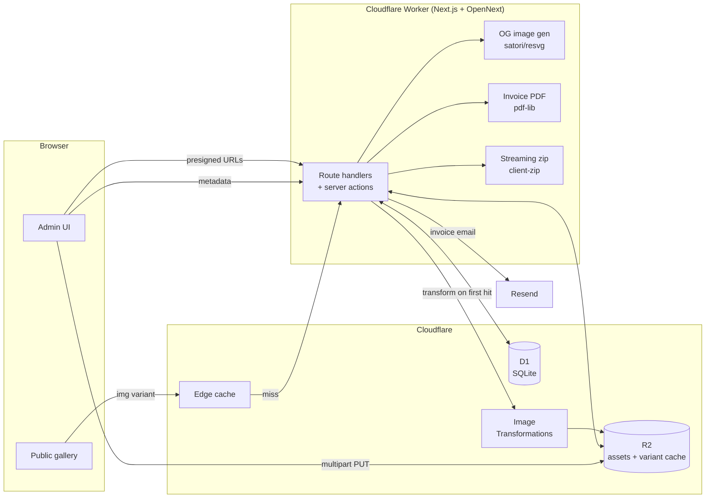

# photos-delivery

Self-hosted client gallery delivery and invoicing for working photographers.
Drag-and-drop upload, custom gallery URLs, rate-card-driven invoices with PDF
+ Resend send.

Live at [galleries.rehders.photos](https://galleries.rehders.photos).

## What it does

- Admin dashboard (galleries, clients, invoices) behind a single-user password.
- Public client galleries with justified-rows grid, lightbox, optional password,
  iOS "press-and-hold to save" UX, and streaming full-gallery zip download.
- Browser-direct multipart upload to R2 — bytes go straight from the browser to
  R2 over presigned URLs, never proxied through the Worker.
- On-demand WebP thumbnail / web variants, cached in R2 and at the Cloudflare
  edge.
- Invoice generator with editable line items, PDF export, Resend send, and
  status (draft / sent / paid) tracking. Line items auto-derive from a rate card
  with standard / hourly / day / double-day tiers + travel-day add-ons.
- OpenGraph link previews — cover photo for public galleries, a lock + logo
  composite for password-protected ones.

## Architecture



## Stack

- **[Next.js 16](https://nextjs.org)** (App Router, Turbopack) on Cloudflare
  Workers via **[@opennextjs/cloudflare](https://opennext.js.org/cloudflare)**.
- **R2** for asset + variant storage, **D1** for metadata.
- **Cloudflare Image Transformations** for resize-on-demand.
- **[aws4fetch](https://github.com/mhart/aws4fetch)** for SigV4 against R2's
  S3-compatible API (multipart upload signing).
- **[pdf-lib](https://pdf-lib.js.org/)**, **[client-zip](https://github.com/Touffy/client-zip)**,
  **[react-photo-album](https://react-photo-album.com/)**.
- **[Resend](https://resend.com)** for invoice email.
- **Source Sans 3 / Source Code Pro** via `next/font`.

## Design notes

- **R2 over S3.** Zero egress is the whole point — a single video at
  18 Mbps × 2 hours = ~16 GB. A team of 5 each re-streaming it would cost
  ~$22 per gallery on S3 and $0 on R2.
- **Browser → R2 direct upload, not proxied.** A 16 GB video through a Worker
  proxy would burn CPU time and request counts. With presigned multipart URLs
  the Worker only signs and orchestrates — the bytes never touch it.
- **Image Transformations + R2 variant cache + edge cache.** First request per
  variant generates the WebP via the IMAGES binding and writes it to R2.
  Subsequent requests serve from R2; a Cache Rule on `/img/*` lets the
  Cloudflare edge intercept entirely so cache hits don't even invoke the
  Worker. Variants stay free at any reasonable viewing volume.
- **Workers Free, not Paid.** 100k req/day, 10ms CPU per request. Image gen,
  PDF gen, and OG image rendering all happen in CPU-light paths (mostly I/O
  to R2 + IMAGES). The Cache Rule above is what makes a viral gallery
  survivable.
- **Per-gallery passwords as HMAC cookies.** No session table; the cookie value
  is `HMAC(SESSION_SECRET, slug + ":" + password_hash)`. Rotating a gallery's
  password automatically invalidates existing unlock cookies.
- **Invoice line items can drift from the rate card.** A draft/sent invoice
  stores its own `line_items_json`. Editing a gallery's hours or package
  auto-refreshes a non-paid invoice's line items; paid invoices are locked.

## Setup

```bash
git clone <this repo>
cd photos-delivery
npm install

npx wrangler login
npx wrangler d1 create photos-delivery
npx wrangler r2 bucket create photos-delivery-assets
# Paste the D1 database_id into wrangler.jsonc, and set "routes" to your hostname.

npx wrangler d1 migrations apply photos-delivery --local
npx wrangler d1 migrations apply photos-delivery --remote
npx wrangler r2 bucket cors set photos-delivery-assets --file r2-cors.json --force

cp .dev.vars.example .dev.vars   # fill in secrets, see .dev.vars.example
npm run dev
```

For production: `npm run deploy`, then `npx wrangler secret put NAME` for each
env var (or `wrangler secret bulk` from a JSON file).
